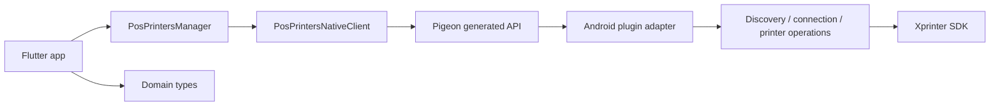

# Architecture

## Decision

The package uses a domain-first Dart API with Pigeon as an internal Android transport. Generated DTOs are still exported for compatibility, but they are not the design source of truth for new features.

## Layers

## Dart

- `PosPrintersManager` owns public workflows: discovery, USB permission handling, printing, status, and network configuration.
- `domain.dart` holds units and presets that make API calls self-documenting: dots, millimeters, DPI, receipt paper, and TSPL label media.
- `native_client.dart` is the seam for tests and isolates Flutter channel usage behind an interface.
- `event_router.dart` installs one Flutter callback handler and fans native events out to every live manager.
- `filter.dart` keeps discovery filtering independent from generated transport code.

## Pigeon

Pigeon is the wire layer between Dart and Android. It should carry transport DTOs and host API calls only. Avoid putting product concepts or policy decisions only in generated code; add a domain type or manager method first, then map to Pigeon.

Current backward-compatible legacy methods still accept raw bitmap widths:

- `printEscHTML`
- `printEscRawData`
- `printZplHtml`
- `printZplRawData`
- `printTsplHtml`
- `printTsplRawData`

Preferred typed methods:

- `printEscHtmlOnPaper`
- `printEscRawDataOnPaper`
- `printTsplHtmlOnMedia`

## Android

The Android side is split into narrow components:

- `PosPrintersPlugin`: Flutter adapter, lifecycle, parameter validation, callback bridging.
- `PrinterConnectionManager`: opens, reuses, and closes SDK connections.
- `PrinterOperations`: sends ESC/POS, ZPL, TSPL, status, serial number, and cash drawer operations.
- `UsbPrinterDiscovery`, `SdkPrinterDiscovery`, `TcpPrinterDiscovery`: discovery adapters.
- `UdpNetworkManager`: UDP network configuration.
- `domain/*`: small pure Kotlin rules, including status normalization, TSPL media geometry, and UDP byte parsing.

## Rules

- Keep Pigeon-generated types out of business logic where a stable domain type is possible.
- Keep Android plugin methods thin: validate, map, delegate, return callback.
- Keep blocking SDK work in the plugin coroutine scope and cancel the scope on detach.
- Keep TCP discovery bounded. Do not scan every host in a large CIDR range.
- Treat TSPL `SIZE`, `GAP`, and `BLINE` as physical millimeter values. Bitmap width is dots.
- Treat USB permission as part of the public workflow, not as an incidental print failure.

## Testing

Dart tests cover public manager behavior, event fan-out, injected native clients, and unit conversion helpers. Kotlin unit tests cover pure Android rules: printer status mapping, TSPL layout, UDP network parsing, and TCP host planning.
